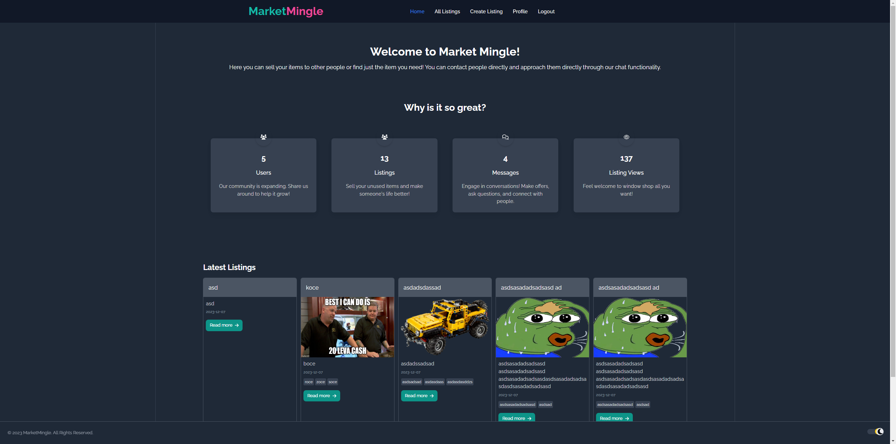
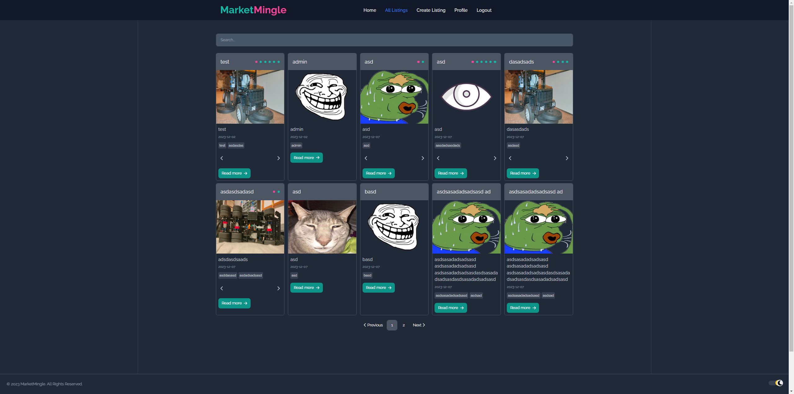

# MarketMingle

> A React project with a .NET backend.

## Table of Contents
* [General Information](#general-information)
* [Built With](#built-with)
* [How It Works](#how-it-works)
* [Features](#features)
* [Screenshots](#screenshots)
* [Setup](#setup)

## ℹ️ General Information
<a name="general-information"/>

MarketMingle is a project designed to connect buyers with sellers. It aims to solve [specific problems] and serves the purpose of [its intended use].
The project was created as a project assignment for [ReactJS - октомври 2023](https://softuni.bg/trainings/4238/reactjs-october-2023).


## ⚒️ Built With
<a name="built-with"/>

### The following NuGet packages are used in the backend project:

- ASP.NET Core: 8.0
- AutoMapper: 12.0.1
- AutoMapper.Extensions.Microsoft.DependencyInjection: 12.0.1
- Microsoft.AspNetCore.Authentication.JwtBearer: 8.0.0
- Microsoft.AspNetCore.Identity.EntityFrameworkCore: 8.0.0
- Microsoft.AspNetCore.OpenApi: 8.0.0
- Microsoft.AspNetCore.SignalR: 1.1.0
- Microsoft.EntityFrameworkCore: 8.0.0
- Microsoft.EntityFrameworkCore.Analyzers: 8.0.0
- Microsoft.EntityFrameworkCore.Design: 8.0.0
- Microsoft.EntityFrameworkCore.SqlServer: 8.0.0
- Microsoft.EntityFrameworkCore.Tools: 8.0.0
- MimeTypesMap: 1.0.8
- Swashbuckle.AspNetCore: 6.5.0

### The following packages are used in the frontend project: 
- @fortawesome/fontawesome-svg-core - 6.4.2
- @fortawesome/free-brands-svg-icons - 6.4.2
- @fortawesome/free-regular-svg-icons - 6.4.2
- @fortawesome/free-solid-svg-icons - 6.4.2
- @fortawesome/react-fontawesome - 0.2.0
- @microsoft/signalr - 8.0.0
- axios - 1.6.1
- js-cookie - 3.0.5
- jwt-decode - 4.0.0
- react - 18.2.0
- react-dom - 18.2.0
- react-paginate - 8.2.0
- react-router-dom - 6.18.0
- react-tag-input-component - 2.0.2
- typeface-raleway - 1.1.13


## 💁 How It Works
<a name="how-it-works"/>

### Guests:
Can view the homepage,\
browse all available listings,\
login/register,\
read doctor profiles.


### Logged-In Users:
Can do the same things as a Guest,\
view a listing's details,\
create/update their listings,\
chat with other users,\
access their profile page.


## 🔨 Features
<a name="features"/>

- CRUD operations for listings
- Uploading multiple images as files
- Chat functionality
- Dark/Light theme
- Responsive design
- Client-side validations
- Client-side search
- Client-side pagination
- JWT authentication
  
  
## 📷 Screenshots
<a name="screenshots"/>





## ⚙️ Setup
<a name="setup"/>

### Backend
1. **Clone the Repository**
2. **Open a terminal in the *api-server* folder and run the following commands:**
   ``` bash
   dotnet user-secrets init
   dotnet user-secrets set "JWTKey:ValidIssuer" "https://localhost:5001"
   dotnet user-secrets set "JWTKey:ValidAudience" "https://localhost:5001"
   dotnet user-secrets set "JWTKey:TokenExpiryTimeInHour" "10"
   dotnet user-secrets set "JWTKey:Secret" "{YOUR SECRET}"
   dotnet user-secrets set "ConnectionStrings:DatabaseConnection" "Server={YOUR SERVER NAME};Database=MarketMingle;Trusted_Connection=True;MultipleActiveResultSets=True;TrustServerCertificate=True;"
   dotnet user-secrets set "CorsOrigins:AllowedOrigins" "https://localhost:5173"
   ```
  *Please change the values in **{ }** with your own.*
  
3. **Run Backend:**
   1. Open the solution in Visual Studio or your preferred IDE.
   2. Build and run the solution.
   3. Now when the database was created with your connection string we will need to manually apply the migrations.
   4. Open a terminal in the *api-server* folder and run the following command:
    ``` bash
    dotnet ef database update
    ```
   5. You are ready to run the solution.

  
### Frontend     
1. **Open a terminal in the *react-client* folder and run the following commands:**
   ```bash
   npm install
   npm run dev
   ```
### Notes
- Make sure the the Backend API url is *https://localhost:5001* and the Frontend URL is *https://localhost:5173* because of some hardcoded values in the code. :(
